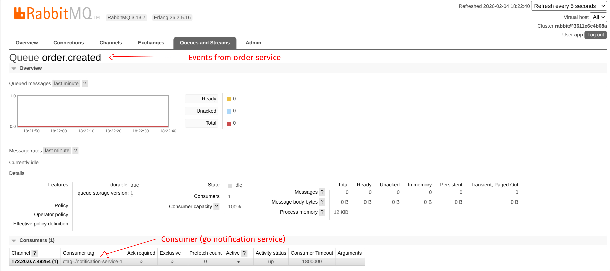

# Part of mini [microservices architecture](https://github.com/noBloodOnTheLeaves/microservices-architecture)

### All services are in a same external network. The network "microservices" needs to be created.
